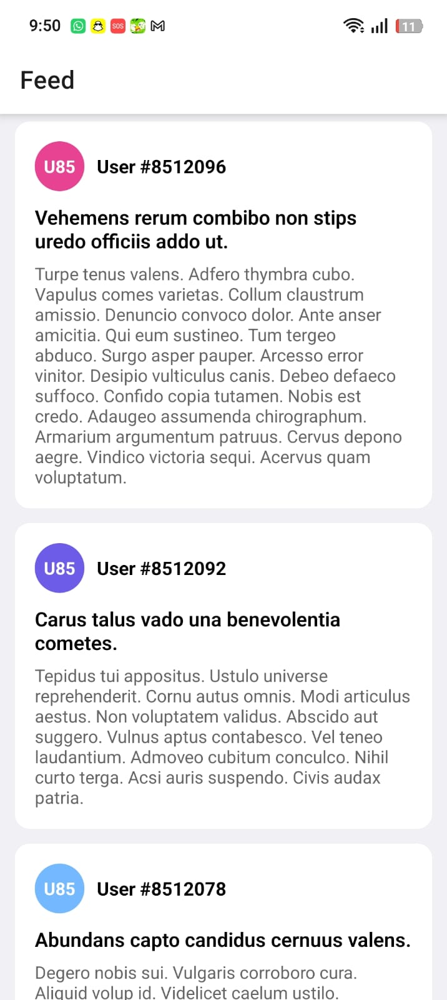
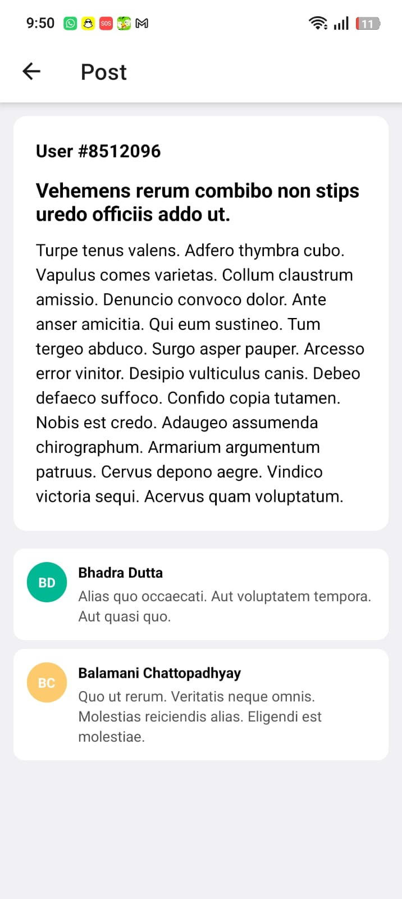

# Social App

A small social feed mobile app built with **Expo (React Native)** and **TypeScript**. Two screens — a Home feed of posts and a Post Details screen with comments — using the public [GoRest API](https://gorest.co.in/).

## Screenshots

| Home (Feed) | Post Details |
|:---:|:---:|
|  |  |

## Features

- Home screen: scrollable list of posts. Each card shows user, avatar (colored initials), title, and content snippet.
- Post Details screen: tapped post on top, comments list below. Each comment has user name, avatar, and content.
- Loading spinners while data is fetching.
- Error states with a "Try again" button if a request fails.
- Empty state when a post has no comments.

## Tech stack

- **Expo** + **React Native** — runs in Expo Go with no native setup
- **TypeScript** — for type safety
- **React Navigation** (`@react-navigation/native-stack`) — for the two-screen flow
- **fetch** (native) — for API calls

## Project structure
social-app-2/

├── App.tsx                       # Navigation container, defines the two screens

├── screens/

│   ├── HomeScreen.tsx            # Feed list, fetches posts

│   └── PostDetailsScreen.tsx     # Post header + comments list

├── screenshots/                  # README screenshots

├── index.ts                      # Expo entry point

└── package.json


## Architecture notes

- **One file per screen.** With only two screens, keeping each screen self-contained (its own fetch, its own state) is the simplest approach.
- **Data passed via navigation params.** When the user taps a post on Home, the full post object is passed to PostDetails as a route param. PostDetails uses it immediately to render the header without re-fetching.
- **Comments fetched per-post.** PostDetails fetches comments from `/posts/{id}/comments` using the post's id, only after navigation. This keeps the feed fast.
- **Three UI states per screen:** loading (spinner), error (message + retry button), success (data).

## API

- Posts: `GET https://gorest.co.in/public/v2/posts`
- Comments for a post: `GET https://gorest.co.in/public/v2/posts/{postId}/comments`
- GoRest v2 returns the data as a plain JSON array — no `{ data }` wrapper. GET requests need no auth token.

## Getting started

### Prerequisites
- Node.js 18+
- Expo Go app on your phone (iOS App Store / Google Play)

### Run
```bash
npm install
npx expo start
```

Scan the QR code with Expo Go (Android) or the Camera app (iOS). Both your phone and PC must be on the same WiFi.

## Time spent

Approximately 3.5 hours.